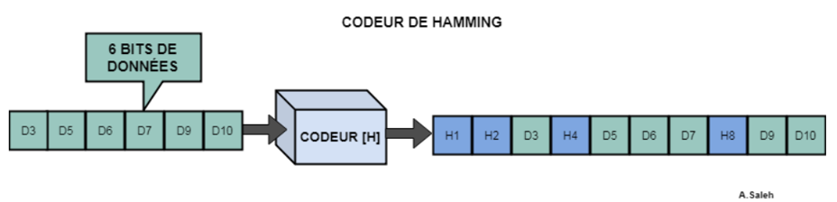
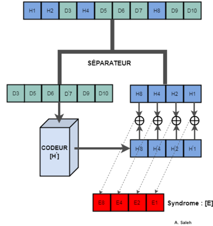
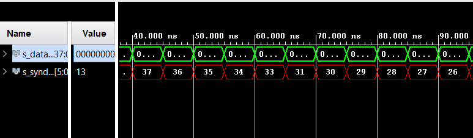

# Hardened RISC-V Processor

As part of the S9 project at ENSEIRB-MATMECA, we developed a hardened processor. A hardened processor refers to a CPU equipped with a set of mechanisms designed to ensure a higher level of reliability against external disturbances that can cause bit flips in the design.

We worked on an FPGA target and used the VHDL hardware description language along with Python to test the project.

Target board:
* [PYNQ Z2](https://pynq.readthedocs.io/en/v2.6.1/getting_started/pynq_z2_setup.html)

## Introduction
### Contexte

As part of the "Ballon Sonde" project at ENSEIRB-MATMECA, an FPGA is used to implement a RISC-V processor. Due to electronic disturbances at a certain altitude, we are tasked with strengthening the RISC-V processor. Indeed, in the space domain, processors must withstand extreme environments, including ionizing radiation, extreme temperatures, as well as significant vibrations and mechanical shocks. This project aims to explore or develop hardened processor architectures that can withstand these constraints while ensuring high reliability and performance. Through techniques such as hardware redundancy and error correction mechanisms, these processors play a key role in space missions, ensuring the continuity of operations even in the most hostile conditions.

## Description
The project is divided into two parts.

1. The triplication of the data-path and the addition of a module to store logs on an SD card.
2. The addition of an encoding-decoding module for error correction on the data memory.

### Part 1: Triplication of the Data-path + SD Recorder

In this part, we will describe the modifications made to the RISC-V processor in terms of the ALU and the error logging module on the SD card.

A set of VHDL files (.vhd) have been added to the project. In this README, we will describe the modifications under the assumption that the reader is already familiar with the RV32I processor code (from a previous project).

Let’s take a look at the VHDL description of the file [alu3.vhd](src/alu3.vhd)


```vhdl
library ieee;
  use ieee.std_logic_1164.all;
  use ieee.numeric_std.all;

library work;
  use work.constants_pkg.all;

entity alu3 is
  port (
    sel_func_alu         : in    std_logic_vector(3 downto 0);
    sel_func_alu_connect : in    std_logic_vector(2 downto 0);
    operand1             : in    std_logic_vector((data_length - 1) downto 0);
    operand2             : in    std_logic_vector((data_length - 1) downto 0);
    result               : out   std_logic_vector((data_length - 1) downto 0);
    val_connect          : out   std_logic;
    alu_error_capture    : out   std_logic;
    r3                   : out   std_logic_vector((data_length*3 - 1) downto 0)
  );
end entity alu3;

architecture behavioral of alu3 is

component alu is
  port (
    sel_func_alu         : in    std_logic_vector(3 downto 0);
    sel_func_alu_connect : in    std_logic_vector(2 downto 0);
    operand1             : in    std_logic_vector((data_length - 1) downto 0);
    operand2             : in    std_logic_vector((data_length - 1) downto 0);
    result               : out   std_logic_vector((data_length - 1) downto 0);
    val_connect          : out   std_logic
  );
end component;

component selector is
  port (
    i0          : in    std_logic_vector((data_length - 1) downto 0);
    i1          : in    std_logic_vector((data_length - 1) downto 0);
    i2          : in    std_logic_vector((data_length - 1) downto 0);
    ce          : out    std_logic;
    r           : out   std_logic_vector((data_length - 1) downto 0)
  );
end component;

signal s_r0, s_r1, s_r2 : std_logic_vector((data_length - 1) downto 0);
signal val_c0, val_c2 : std_logic;
signal val_c1 : std_logic;

begin

process(val_c0, val_c1, val_c2) is
begin
  if ((val_c0 = val_c1) and (val_c1 = val_c2)) then
      val_connect <= val_c0;
  elsif (val_c0 /= val_c1) and (val_c1 = val_c2) then 
      val_connect <= val_c1;
      
  elsif (val_c0 = val_c1) and (val_c1 = not val_c2) then
      val_connect <= val_c0;
  else
      val_connect <= val_c0;
  end if;
end process;

alu0 : alu
port map (
  sel_func_alu          => sel_func_alu,
  sel_func_alu_connect  => sel_func_alu_connect,
  operand1              => operand1,
  operand2              => operand2,
  result                => s_r0,
  val_connect           => val_c0);

alu1 : alu
port map (
  sel_func_alu          => sel_func_alu,
  sel_func_alu_connect  => sel_func_alu_connect,
  operand1              => operand1,
  operand2              => operand2,
  result                => s_r1,
  val_connect           => val_c1);

alu2 : alu
port map (
  sel_func_alu          => sel_func_alu,
  sel_func_alu_connect  => sel_func_alu_connect,
  operand1              => operand1,
  operand2              => operand2,
  result                => s_r2,
  val_connect           => val_c2);
    
inst_selector: selector
port map (
  i0 => s_r0,
  i1=> s_r1,
  i2=> s_r2,
  ce => alu_error_capture,
  r => result);

  r3 <= s_r2 & s_r1 & s_r0;

end architecture behavioral;

```

We instantiate the ALU 3 times and redirect the outputs to a `selector` module, which determines the correct result and triggers (or not) the writing of an error `log` to the SD card.

The details of the selector's choices can be found in [selector.vhd](src/selector.vhd).

Once the modifications are made and the correct wiring is done, we build a top-level module for our processor.


```vhdl
entity my_RISCVCord_v1_0_S00_AXI is
	generic (
		-- Users to add parameters here

		-- User parameters ends
		-- Do not modify the parameters beyond this line

		-- Width of S_AXI data bus
		C_S_AXI_DATA_WIDTH	: integer	:= 32;
		-- Width of S_AXI address bus
		C_S_AXI_ADDR_WIDTH	: integer	:= 6
	);
	port (
		-- Users to add ports here

		-- User ports ends
		-- Do not modify the ports beyond this line

		-- Global Clock Signal
		S_AXI_ACLK	: in std_logic;
		-- Global Reset Signal. This Signal is Active LOW
		S_AXI_ARESETN	: in std_logic;
		-- Write address (issued by master, acceped by Slave)
		S_AXI_AWADDR	: in std_logic_vector(C_S_AXI_ADDR_WIDTH-1 downto 0);
		-- Write channel Protection type. This signal indicates the
    		-- privilege and security level of the transaction, and whether
    		-- the transaction is a data access or an instruction access.
		S_AXI_AWPROT	: in std_logic_vector(2 downto 0);
		-- Write address valid. This signal indicates that the master signaling
    		-- valid write address and control information.
		S_AXI_AWVALID	: in std_logic;
		-- Write address ready. This signal indicates that the slave is ready
    		-- to accept an address and associated control signals.
		S_AXI_AWREADY	: out std_logic;
		-- Write data (issued by master, acceped by Slave) 
		S_AXI_WDATA	: in std_logic_vector(C_S_AXI_DATA_WIDTH-1 downto 0);
		-- Write strobes. This signal indicates which byte lanes hold
    		-- valid data. There is one write strobe bit for each eight
    		-- bits of the write data bus.    
		S_AXI_WSTRB	: in std_logic_vector((C_S_AXI_DATA_WIDTH/8)-1 downto 0);
		-- Write valid. This signal indicates that valid write
    		-- data and strobes are available.
		S_AXI_WVALID	: in std_logic;
		-- Write ready. This signal indicates that the slave
    		-- can accept the write data.
		S_AXI_WREADY	: out std_logic;
		-- Write response. This signal indicates the status
    		-- of the write transaction.
		S_AXI_BRESP	: out std_logic_vector(1 downto 0);
		-- Write response valid. This signal indicates that the channel
    		-- is signaling a valid write response.
		S_AXI_BVALID	: out std_logic;
		-- Response ready. This signal indicates that the master
    		-- can accept a write response.
		S_AXI_BREADY	: in std_logic;
		-- Read address (issued by master, acceped by Slave)
		S_AXI_ARADDR	: in std_logic_vector(C_S_AXI_ADDR_WIDTH-1 downto 0);
		-- Protection type. This signal indicates the privilege
    		-- and security level of the transaction, and whether the
    		-- transaction is a data access or an instruction access.
		S_AXI_ARPROT	: in std_logic_vector(2 downto 0);
		-- Read address valid. This signal indicates that the channel
    		-- is signaling valid read address and control information.
		S_AXI_ARVALID	: in std_logic;
		-- Read address ready. This signal indicates that the slave is
    		-- ready to accept an address and associated control signals.
		S_AXI_ARREADY	: out std_logic;
		-- Read data (issued by slave)
		S_AXI_RDATA	: out std_logic_vector(C_S_AXI_DATA_WIDTH-1 downto 0);
		-- Read response. This signal indicates the status of the
    		-- read transfer.
		S_AXI_RRESP	: out std_logic_vector(1 downto 0);
		-- Read valid. This signal indicates that the channel is
    		-- signaling the required read data.
		S_AXI_RVALID	: out std_logic;
		-- Read ready. This signal indicates that the master can
    		-- accept the read data and response information.
		S_AXI_RREADY	: in std_logic;
		

		-- CC 
		-- signaux pour la mémoire de débug 
		alu_error_capture : out std_logic;
		error_msg : out std_logic_vector((data_length*4 -1) downto 0)
	);
```

The processor elements, such as data and instruction memory, are accessible via the AXI4 protocol. We have previously tested the CPU using PYNQ and the MMIO class from Python.

Note: Although the source code for the CORDIC extension is present in the archive, it has been removed from the top-level to keep only the main RV32I extension.

The two signals are:


```
alu_error_capture : out std_logic;
error_msg : out std_logic_vector((data_length*4 -1) downto 0)
````


- **alu_error_capture** indicates that an error has occurred, and **error_msg** contains the results from the 3 ALUs as well as the value of the PC.


At the bottom left of the image above, you can see the RISC-V processor with the addition of the 2 new outputs.

Now, we need a way to store the message when a rising edge of **alu_error_capture** is detected.

The first approach was to store the log (128-bit message) in a BRAM, which could be easily accessed later by the PS (Processing System). However, the final choice was to use an **SD card**, which has the advantage of retaining the information even without power.

To send the log message to the SD card, we used a module provided by **Y. Bornat** as part of the second-year VHDL projects.

* [SDcard Management Module](https://yannick-bornat.enseirb-matmeca.fr/wiki/doku.php/en202:sdcard)

Please refer to the Y.Bornat for the licensing fo the 2 SDcard_* files.

We chose to use `SDcard_writestream.vhd` because error messages can be treated as a stream of errors to be recorded.

We kept the default mode of `SDcard_writestream`, which sends data to the SD card in 8-bit packets. Therefore, we added an FSM to send the 16 packets sequentially.

The `top_sd_save` module encapsulates `SDcard_writestream`, our `FSM`, and the logic that allows manually injecting an error log into the SD card.

The module can operate normally or be forced to verify its correct operation.

To use the `top_sd_save` module, simply connect the clock, reset (active high), error message, and message enable signal. The `inject_error` input forces the writing of the error message `x"0f0e0d0c0b0a09080706050403020100"` on every rising edge.


TODO: Many signals can be removed from the module as their presence is only useful for debugging.

**WARNING:**
For use with the PYNQ board and a block design, you must absolutely do the following:
> Generate Block Design -> Global.

For a global view of the project, see [design1.pdf](doc/design1.pdf).

You can find the constraints file for the pynq-z2 [here](src/xdc/pynqz2.xdc), where the switches are used for forcing the error injection in the SD and the for the reset.
To force the flush of the SD card you can used a button (but the FSM handle it in the latest version).


- For a better understanding of the FSM related to this module  [error_to_sd](/src/sd/error_to_sd.vhd) please refer to the following FSM graph: [fsm](doc/fsm_sd.jpg)


### Part 2 : Error Correction Code

#### Concept

In order to correct the errors in the data bus,  a Hamming correction code is used. It consists of encoding the data by adding control bits to it. After it is encoded, the data and its control bits are stored in the memory. The encoding process is summarized in the following figure.


Then, when the data needs to be read from the memory, it has to be decoded before accessing the CPU. During the decoding process, the data bits and control bits are separated.
The data is encoded again and the new control bits are compared to those stored in the memory.
The comparison is made using a XOR gate which returns the position of the error, also called the syndrome. If the syndrome equals zero, no error has been detected.


#### VHDL implementation

##### Encoder

The encoder module takes a 32-bit data in input and adds 6 control bits to it. Thus, the output contains 38 bits.
Each parity bit is calculated using xor gates on multiple bits of the original message. The six parity bits calculation is done inside the encoder.
```
entity hamming_enc is
    Port (  data_in : in STD_LOGIC_VECTOR(31 downto 0);
            data_out : out STD_LOGIC_VECTOR(37 downto 0));
end hamming_enc;

architecture Behavioral of hamming_enc is
signal parity : std_logic_vector(5 downto 0);     
begin

codageHamming : process(data_in)
variable temp : std_logic;
begin
    parity(0) <= data_in(31) xor data_in(30) xor data_in(28) xor data_in(27) xor  data_in(25) xor data_in(23) xor data_in(21) xor data_in(20) xor data_in(18) xor data_in(16) xor data_in(14) xor data_in(12) xor data_in(10) xor data_in(8) xor data_in(6) xor data_in(5) xor data_in(3) xor data_in(1);
    parity(1) <= data_in(31) xor data_in(29) xor data_in(28) xor data_in(26) xor data_in(25) xor data_in(22) xor data_in(21) xor data_in(19) xor data_in(18) xor data_in(15) xor data_in(14) xor data_in(11) xor data_in(10) xor data_in(7) xor data_in(6) xor data_in(4) xor data_in(3) xor data_in(0);
    parity(2) <= data_in(30) xor data_in(29) xor data_in(28) xor data_in(24) xor data_in(23) xor data_in(22) xor data_in(21) xor data_in(17) xor data_in(16) xor data_in(15) xor data_in(14) xor data_in(9) xor data_in(8) xor data_in(7) xor data_in(6) xor data_in(2) xor data_in(1) xor data_in(0);
    parity(3) <= data_in(27) xor data_in(26) xor data_in(25) xor data_in(24) xor data_in(23) xor data_in(22) xor data_in(21) xor data_in(13) xor data_in(12) xor data_in(11) xor data_in(10) xor data_in(9) xor data_in(8) xor data_in(7) xor data_in(6);
    parity(4) <= data_in(20) xor data_in(19) xor data_in(18) xor data_in(17) xor data_in(16) xor data_in(15) xor data_in(14) xor data_in(13) xor data_in(12) xor data_in(11) xor data_in(10) xor data_in(9) xor data_in(8) xor data_in(7) xor data_in(6);
    parity(5) <= data_in(5) xor data_in(4) xor data_in(3) xor data_in(2) xor data_in(1) xor data_in(0);
end process codageHamming;
data_out <= data_in & parity;
end Behavioral;
```

##### Decodeur
The decoder takes the 38-bit encoded word stored in the memory and returns the syndrome and the data. The decoder does not correct the error but only gives its position and the data that needs to be corrected. The corrector should be in a separate module.
The decoder module contains an instantiation of the encoder and a process:
-	The process separates the data (s_data) from the control bit (s_parity).
-	The data (s_data) is encoded and the control bits (s_enc) are compared with the s_parity signal through a XOR gate.
The modules returns the data (s_data) and the syndrome.
```
entity hamming_dec is
    Port (  data_in : in std_logic_vector(37 downto 0);
            data_out : out std_logic_vector(31 downto 0);
            syndrome : out std_logic_vector(5 downto 0));
end hamming_dec;

architecture Behavioral of hamming_dec is

component hamming_enc is
    Port (  data_in : in STD_LOGIC_VECTOR(31 downto 0);
            data_out : out STD_LOGIC_VECTOR(37 downto 0));
end component hamming_enc;

signal s_data : std_logic_vector(31 downto 0) := (others => '0');
signal s_parity : std_logic_vector(5 downto 0) := (others => '0');
signal s_enc : std_logic_vector(37 downto 0);


begin

separation : process(data_in)
begin
    s_parity <= data_in(5 downto 0);
    s_data <= data_in(37 downto 6);
end process separation;

enc : hamming_enc
port map(   data_in => s_data,
            data_out => s_enc);

syndrome <= s_parity xor s_enc(5 downto 0);
data_out <= s_data;
end Behavioral;
```
##### Testing
To test the modules, a testbench of the decoder is created. For the test, an encoded signal is created and given to the input of the decoder.
An error is introduced to the data, and shifted to the left.
The syndrome should decrement every time the error shifts. This what is observed on the next figure.


Now the error correction module can be implemented in the architecture.


## Authors
* COLLIN Florian
* CLIN Iman
* MILIEN Noah
* Augustin